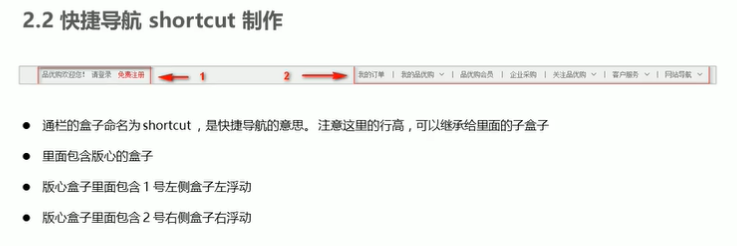
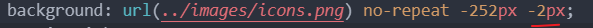

# 1.项目整体介绍

- 首页

- 列表页

- 注册页面

# 2.项目学习目的

1.品优购项目是电商网站的模仿 而电商类网站比较综合 里面涉及到了大量的**布局技术**。

包括 布局方式 常见效果 周边技术

2.品优购项目能复习、总结、提高基础班所学的**布局技术**。

哪里有不足 就强化一下哪里哦~

3.写完品优购项目 能对<u>实际开发</u>中**制作PC端的页面流程**有一个整体的认知。

4.为后期学习移动端项目做一个铺垫。

# 3.品优购项目搭建

初步布局

# 4.样式的模块化开发

将一个项目按功能划分 一个功能一个模块 互不影响

模块化开发具有**重复使用 更换方便**的优点

# 5.网站favicon图标

1.制作favicon图标

- 把想要做图标的图片 以png格式 切出来 
- 把png图片转变成ico文件——求助于特定网站 比特虫

> bitbug.net

2.放到网站根目录下

3.HTML页面引入favicon图标

# 6.网站的TDK三大标签SEO优化

SEO (Search Engine Optimization) 搜索引擎优化 是：

> 一种利用搜索引擎的规则提高网站在有关搜索引擎内自然排名的方式。

SEO的目的：

> 对网站进行深度的优化 从而帮助网站获取免费的流量
>
> 进而在搜索引擎上提升网站的排名 提高网站的知名度

网站排名 例如：

写的网站 尽量符合 SEO  让搜索引擎更好地找到我们~

而TDK写好了 就可以让搜索引擎更好地找到我们 获得免费的“流量”

三大标签TDK——

> Title 网站标题
>
> Description 网站说明
>
> Keyword 关键字

## 1.title网站标题

## 2.Description 网站说明

## 3.Keyword 关键字

# 7.首页制作

# 一阶段  有公共部分的样式

做有公共部分的样式

（因为一共要做三个页面嘛）

## 7.1 快捷导航制作

注意 

导航 用 ul>li来做即可

### 左侧一个小盒子

### 右侧一个小盒子

## 7.2 header头部制作

### 7.2.1 logo制作

logo制作学问多~

注意点**

链接a 是行内元素 需要转化成块级 好设置宽高

### 7.2.2 搜索框

### 7.2.3 热词模块制作

### 7.2.4 购物车模块

** 

## 7.3 nav导航模块

### dropdown

分为dt（“全部商品分类”6个字） 和 dd（详细分类）两个部分

**左右居中 上下居中

line-heihgt表示文字垂直居中

#### dd 详细分类

### navitems

**扩大a的范围 可以点击的范围就更大了 所以 padding值给a（链接）

**a是行内元素 想设置宽高 一定要转换呐~重复强调了多少遍咯

## 7.4 footer模块

**扣精灵图的方法 需要再了解下

获得——

有些不准确！

这个标准多了~——

# 二阶段 首页专有的主体模块

【1】注意排列得很整齐的部分 一般都是 ul>li 做的 

如果有导航 就在里面套个a标签

【2】如果要设置一个压制其他盒子的图案或者文字 用定位即可

记住 子绝父相！ 

【3】头部和主体的概念

典型的上下两块 都用这段代码做框架

【4】tab栏切换效果 

用到js 

【5】一般情况下

a包括了 有宽度的盒子 必须要转化为块级元素

​	

# 8.列表页制作

## 9.注册页制作

### registerarea布局

